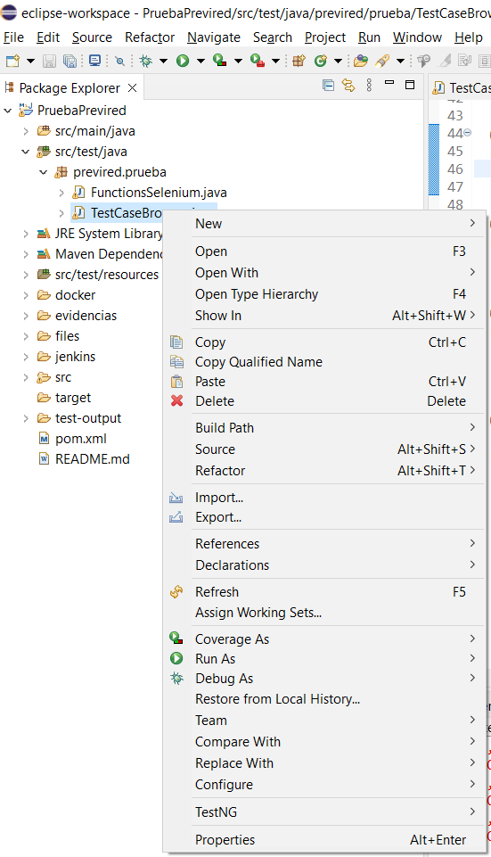
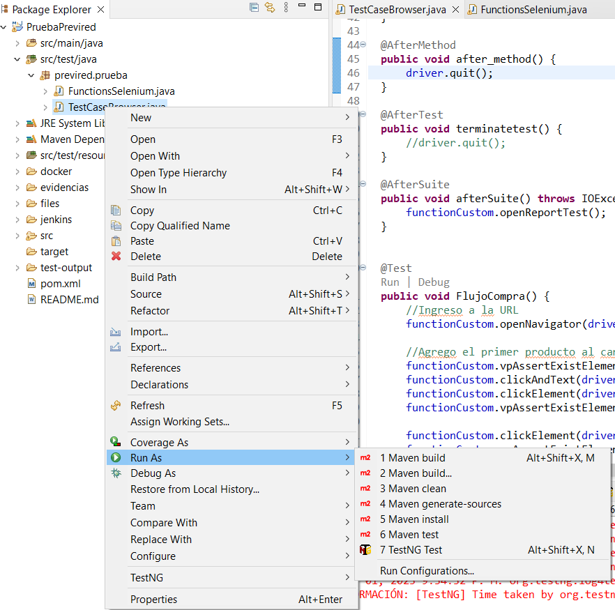
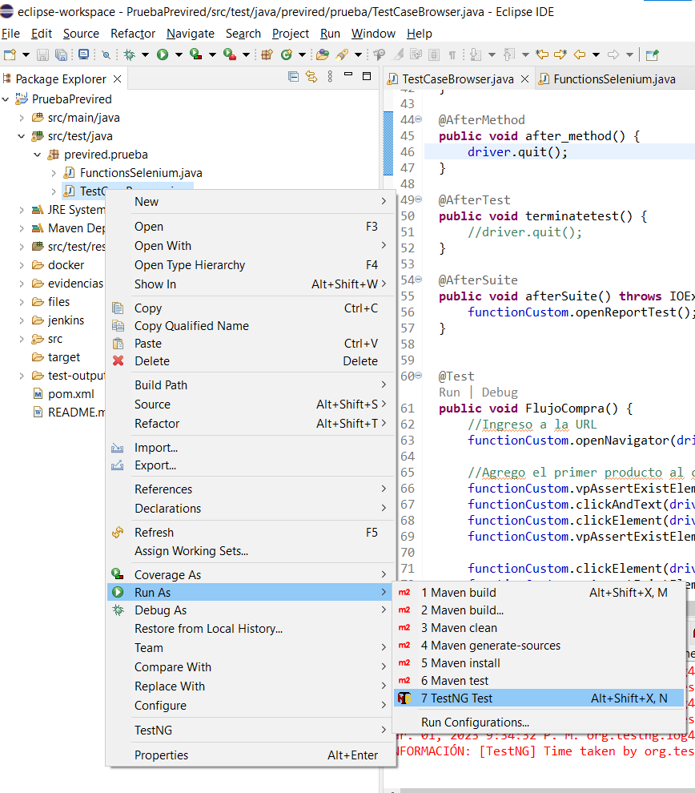
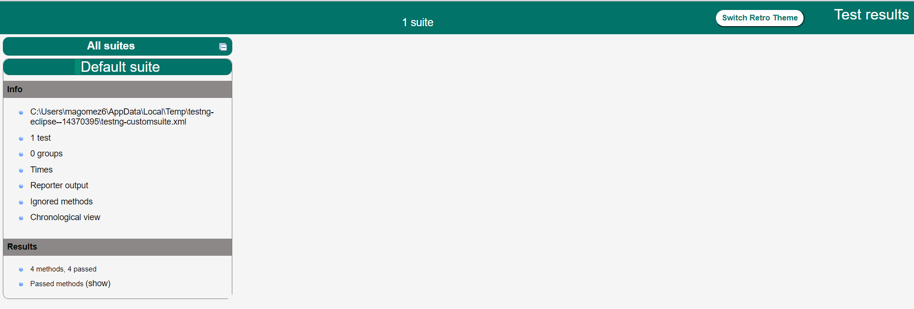
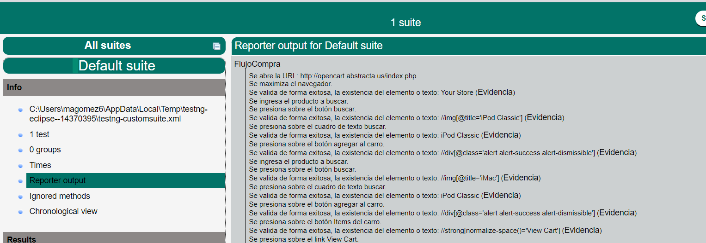
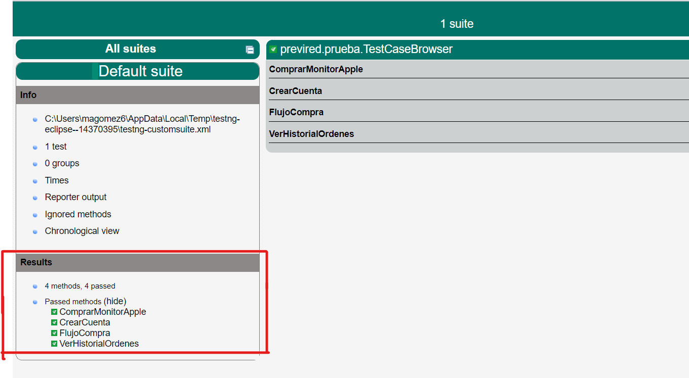

# Desafío_Automatización_QA

En el presente proyecto, se realizó la automatización de un flujo solicitado por el cliente, el cual corresponde a:

* Ingresar a opencart.abstracta.us
* Añadir al carro de compras un Ipod Classic
* Añadir al carro de compras un Imac
* Proceder a realizar la compra
* Realizar login con credenciales obtenidas de un archivo externo a elección (Basta que sea un email con estructura válida y contraseña)
* Crear una cuenta
* Continuar con la compra y llegar a la orden completa
* Visitar el historial de órdenes y validar resumen de orden
* Cerrar sesión

# Pre-requisitos
* Tener instalado Java.
* Tener instalado Eclipse.
* Tener instlado el pluging TestNG For Eclipse.
* Tener conexión a internet.

# Instrucciones para ejecutar
* Ingresar a Eclipse.
* Importar la carpeta del proyecto.
* Esperar a que los archivos asociados al proyecto carguen, dado que el proyecto esta construido con Maven.
* Ingresar a la ruta:
  - PruebaPrevired\src\test\java\previred\prueba
* En la ruta se visualizará dos archivos con extensión java:
  - TestCaseBrowser.java
  - FunctionsSelenium.java
* La forma de ejecutar los casos automatizados es la siguiente:
  - Hacer click derecho en el archivo "TestCaseBrowser.java"
  
  - En el menú que se despliega se debe llevar el mouse sobre la opción "Run As"
  
  - En el nuevo menú que se despliega se debe llevar el mouse sobre la opción "TestNG Test"
  
  - Como resultado se abriran los navegadores para las ejecuciones y además se podrá ver la ejecución en la consola de Eclipse.
  
* Una vez finalizada la ejecución se abrira un archivo "index.html" el cual es el reporte de la ejecución realizada.

# Reporte
* El contenido del reporte se encuentra en la ruta:
  - PruebaPrevired\test-output
* Para ver el reporte se debe abrir el archivo:
  - index.html
* Extructura del informe:
  - Para ver el paso a paso del los casos de prueba se debe ir al apartado Info -> Reporter output
  
  - Para ver el resultado de la ejecución de los diferentes casos se debe ir al apartado Result -> Passed methods
  
  
# Evidencias
* Las evidencias se encuentra en la ruta:
  - PruebaPrevired\evidencias
* Dentro de la carpeta se tiene una carpeta por cada caso de prueba, ejemplo: "ComprarMonitorApple_20233201_213202", que se compone de la siguiente estructura
  - Nombre del Test Case, ejemplo: "ComprarMonitorApple"
  - El caracter "_"
  - Año en formato yyyymmdd, ejemplo: 20233202
  - El caracter "_"
  - Hora en formato HHmmss, ejemplo: 131011
 
 # Detalle del Flujo
*Para este proyecto se diseñaron los siguientes casos de pruebas:
   - FlujoCompra
   - CrearCuenta
   - VerHistorialOrdenes
   - ComprarMonitorApple
* En los casos se abordaron punto genericas como el login, logout y las diferentes validaciones.